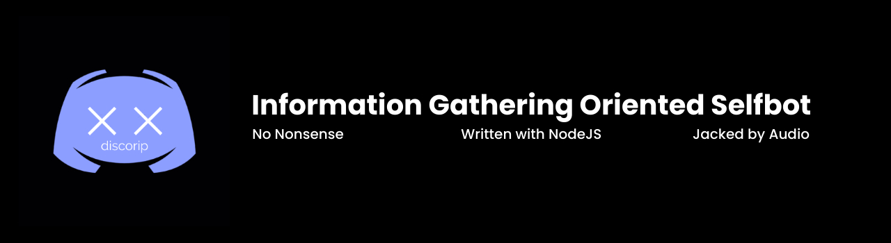

# discorip
 

## Selfbot made in NodeJS, with the sole intention of gathering information through discord.

## Installation 

1. Visit https://nodejs.org/en/ and download version 10+.
2. Download and extract the contents of this Github repository.
3. Navigate to the extracted folder, then into the child folder 'util' and open **config.json** in your preferred text editor.
4. Fill in the token field with your discord token. Save your changes and then exit the file.
5. Run **install.bat**. If this doesn't work, open CMD and navigate to the project folder, then type **npm install** and press **Enter**.
6. Now, run **start.bat** from discorip's root directory. If this doesn't work, open CMD and navigate to the project folder, then type **node index.js** and press **Enter**.
7. **discorip** should now be up and running! Try testing it by going into discord and typing **;help**.

## Setting up lookups

1. Create an account on [Melissa](https://www.melissa.com/).
2. After you have created an account, navigate to the [User Account](https://www.melissa.com/user/user_account.aspx) page.
3. On the [User Account](https://www.melissa.com/user/user_account.aspx) page, look for **License Key Using Credits** and copy the corresponding value.
4. From the root directory of discorip, navigate to *modules* -> *rip* -> and proceed to open **ripConfig.json** in your preferred text editor.
5. Replace the **melissaKey** value with the key you copied from the Melissa [User Account](https://www.melissa.com/user/user_account.aspx) page.
6. All done!

## Using discorip with multiple accounts

1. Navigate to the **config.json** file.
2. Add more values to the token table, separated by commas.

      **example: "tokens": ‎‎["token1, "token2", "token3"]‎‎**

# Jacked by audio. Message audio#0580 with any inquiries.
