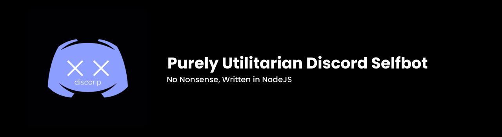

# discorip
 

## Utilitarian Selfbot made in NodeJS.

## Features
- No Nonsense
- Easy Setup
- Raid Tools
- Lookups (email, ipv4, phone, etc...)
- Custom Status
- Hidden Server Information
- User Information
- More to come!

## Installation 

1. Visit https://nodejs.org/en/ and download version 10+.
2. Download and extract the contents of the [latest release](https://github.com/audioo/discorip/releases/).
3. Navigate to the extracted folder, then into the child folder 'util' and open **config.json** in your preferred text editor.
4. Fill in the token field with your discord token. Save your changes and then exit the file.
5. Run **install.bat**. If this doesn't work, open CMD and navigate to the project folder, then type **npm install** and press **Enter**.
6. Now, run **start.bat** from discorip's root directory. If this doesn't work, open CMD and navigate to the project folder, then type **node index.js** and press **Enter**.
7. **discorip** should now be up and running! Try testing it by going into discord and typing **;help**.

## Setting up lookups

1. Create an account on [Melissa](https://www.melissa.com/).
2. After you have created an account, navigate to the [User Account](https://www.melissa.com/user/user_account.aspx) page.
3. On the [User Account](https://www.melissa.com/user/user_account.aspx) page, look for **License Key Using Credits** and copy the corresponding value.
4. From the root directory of discorip, navigate to *modules* -> *rip* -> and proceed to open **ripConfig.json** in your preferred text editor.
5. Replace the **melissaKey** value with the key you copied from the Melissa [User Account](https://www.melissa.com/user/user_account.aspx) page.
6. All done!

**NOTE**
It is likely that the lookups will return the code GE09 which is thrown when an account isnt being recognized or doesnt exist. In the case of not being recognized, that occurs sometimes when an is just made. It takes up to 3-4 hours for the account keys to be replicated arcross the array.

## Using discorip with multiple accounts

1. Navigate to the **config.json** file.
2. Add more values to the token table, separated by commas.

      **example: "tokens": ‎‎["token1, "token2", "token3"]‎‎**

## Commands
**PREFIX:** 
     
     (   ;   )

**RIP MODULE:**
     
     - check-host
     
     - companylookup
     
     - emaillookup
     
     - iplookup
     
     - phonelookup

**USER MODULE:**
     
     - avatar
     
     - whois
     
     - token

**SERVER MODULE:**
     
     - server-channels
     
     - server-roles
     
     - server-info

**RAID MODULE:**
     
     - raid-server-inflate
     
     - raid-channel-delete
     
     - raid-user-ban

**INFO MODULE:**
     
     - about
     
     - help
     
     - uptime
     
**ACTIVITIES MODULE:**
     
     - playing
     
     - watching
     
     - listening
     
     - streaming

# Jacked by audio. Message audio#0580 with any inquiries.
